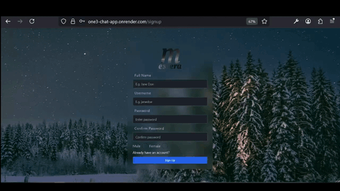

<h1 align="center">
  Messera — Real-Time Chat Application
</h1>

<p align="center">
  
  
  
  
  
  
  
</p>

<p align="center">
  Real-time messaging application with instant communication, online presence tracking, and secure JWT authentication.
</p>

---

## Preview

<p align="center">
  
</p>
<p align="center">
  Full application walkthrough — authentication, messaging, and online presence tracking.
</p>
<p align="center">
  <a href=".github/preview-chat-app.gif">▶ Watch Full HD Preview</a>
</p>
<p align="center">
  🚀 <a href="https://one3-chat-app.onrender.com">Open Live Application</a>
</p>

---

## Overview

**Messera** is a real-time chat application built on the MERN stack. It enables users to exchange instant messages, track friends' online presence, and communicate securely — all in a clean, responsive interface.

Key features:

- Real-time messaging powered by Socket.io
- Online presence indicator in the sidebar
- User search to find and start conversations
- Secure authentication with JWT stored in HTTP-only cookies
- Password hashing with bcryptjs
- Persistent sessions across page refreshes
- Fully responsive UI built with Tailwind CSS

---

## Tech Stack

| Layer | Technology |
|---|---|
| Frontend | React 18, Vite, Tailwind CSS |
| State Management | Redux Toolkit, RTK Query |
| Real-Time | Socket.io |
| Backend | Node.js 20, Express 5 |
| Database | MongoDB 8 (Mongoose) |
| Auth | JWT (HTTP-only cookies), bcryptjs |
| Deployment | Render |

---

## Features

### Authentication
- Manual signup with full name, username, password, and gender
- Login with username and password
- JWT stored in HTTP-only cookie — protected against XSS
- Password confirmation validation on signup

### Messaging
- Real-time message delivery via Socket.io
- Conversation history persisted in MongoDB
- Search bar to find users by username
- Sidebar showing all conversations with online indicators

### Online Presence
- Live online/offline status tracked via Socket.io connection events
- Sidebar updates in real time when friends connect or disconnect

---

## Getting Started

### Prerequisites

- Node.js 20+
- MongoDB (local or Atlas)

### Environment Variables

Create a `.env` file in the backend root:

```env
MONGO_URI=mongodb+srv://...
JWT_SECRET=your_jwt_secret
PORT=5000
NODE_ENV=development
```

### Installation & Development

```bash
# Install backend dependencies
npm install

# Install frontend dependencies
cd frontend && npm install

# Run backend
npm run dev

# Run frontend
cd frontend && npm run dev
```

---

## Roadmap

- File, photo, and audio sharing
- Group conversations (public and private)
- Voice and video calls
- Enhanced user search and filtering
- Privacy and security settings
- End-to-end encryption