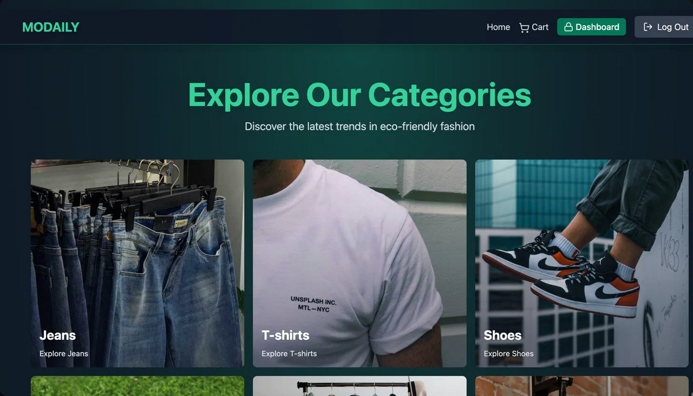
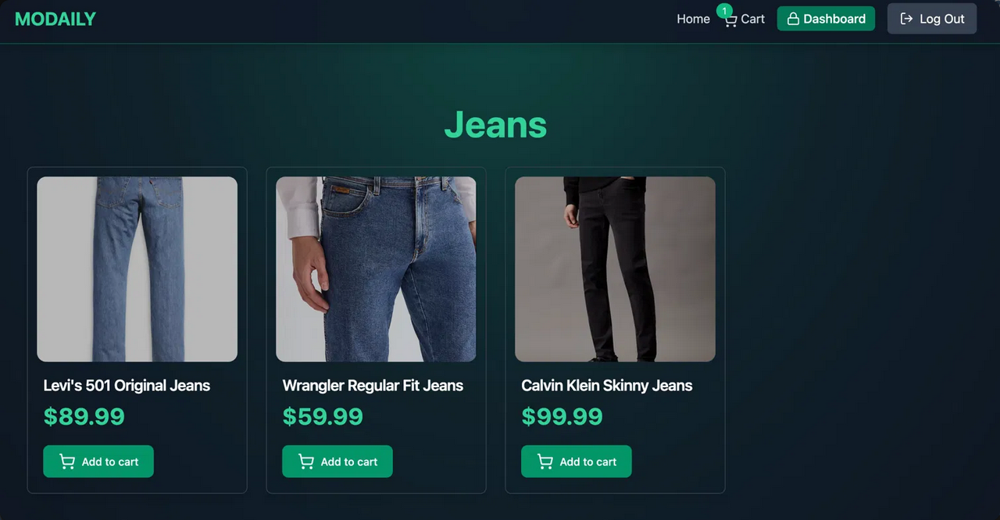
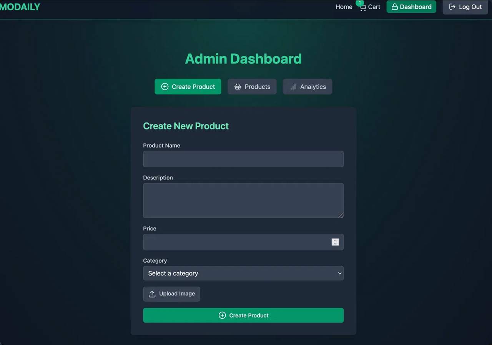
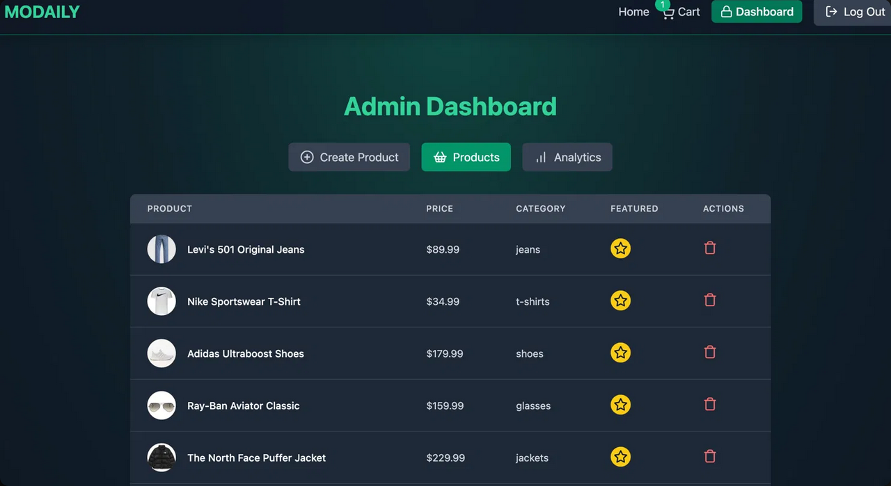
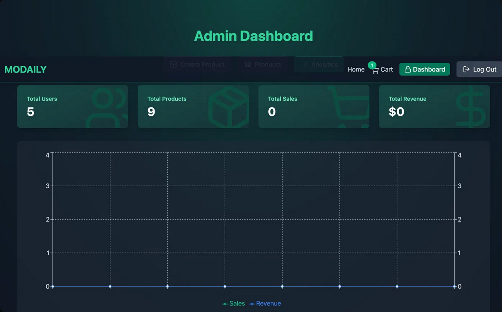
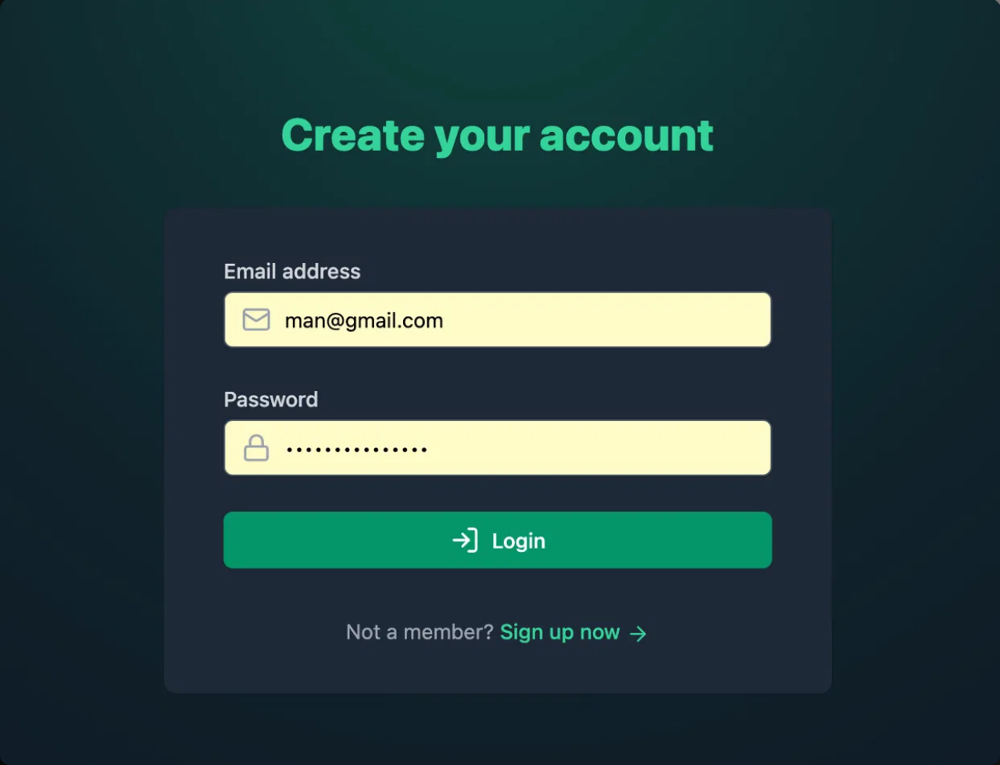
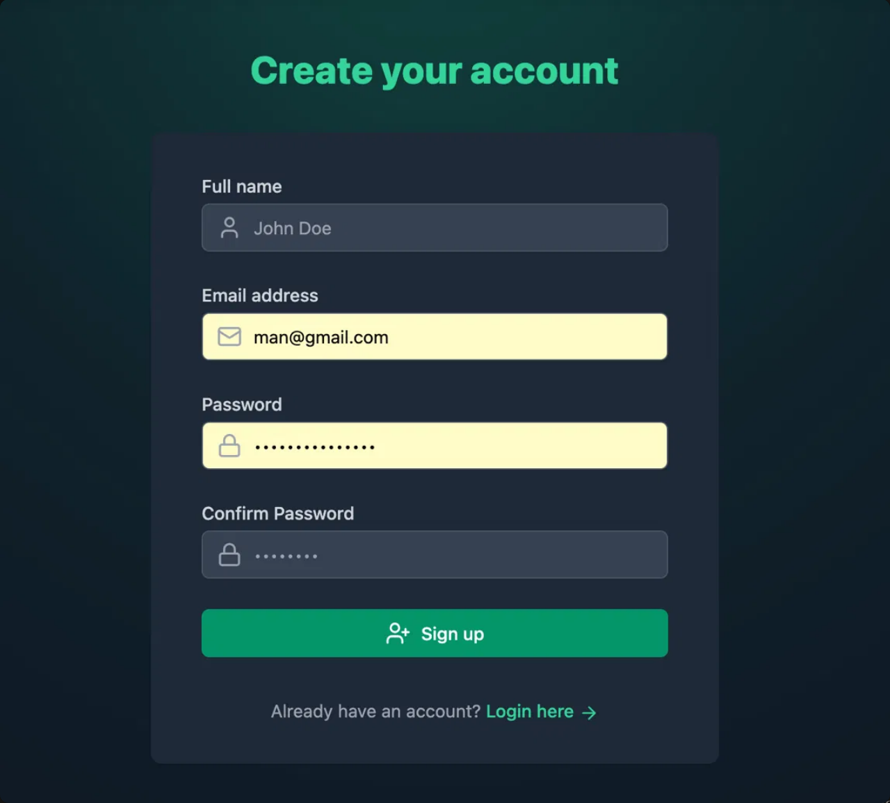

# Modaily — E-Commerce Platform

<p align="center">
  
  
  
  
  
  
  
  
  
</p>

<p align="center">
  Full-stack MERN e-commerce platform with Stripe payments, Redis caching, admin dashboard, and coupon system.
</p>

---

## Preview

<p align="center">
  
</p>
<p align="center">
  Full application walkthrough — browsing categories, shopping cart, Stripe checkout, and admin dashboard.
</p>
<p align="center">
  <a href=".github/assets/preview.gif">▶ Watch Full HD Preview</a>
</p>

---

## Overview

**Modaily** is a modern full-stack e-commerce application built on the MERN stack. It supports product browsing by category, a shopping cart with real-time totals, Stripe-powered checkout with coupon discounts, and a full admin panel for product and analytics management.

Key features:

- Browse fashion products across 6 categories (Jeans, T-shirts, Shoes, Glasses, Jackets, Suits, Bags)
- Featured products carousel on the home page (cached in Redis)
- Shopping cart with quantity management and real-time total calculation
- Stripe Checkout integration with coupon code support
- Automatic reward coupons generated for orders over $200
- Admin dashboard with product creation, featured toggle, deletion, and analytics charts
- JWT authentication with access token (15 min) + refresh token (7 days) stored in HTTP-only cookies
- Automatic silent token refresh via Axios interceptor
- Product images uploaded to Cloudinary
- Redis (Upstash) caching for featured products

---

## Preview

---

### 🏠 Home — Category Explorer

<p align="center">
  
</p>
<p align="center">
  Home page with all product categories displayed as full-image cards. Clicking any card navigates to the filtered product listing.
</p>

---

### 👖 Category Page

<p align="center">
  
</p>
<p align="center">
  Category product listing with product cards showing image, name, price, and Add to Cart button. Cart badge updates live.
</p>

---

### ➕ Admin — Create Product

<p align="center">
  
</p>
<p align="center">
  Admin dashboard — Create Product tab with name, description, price, category selector, and Cloudinary image upload.
</p>

---

### 📦 Admin — Products List

<p align="center">
  
</p>
<p align="center">
  Admin products table with thumbnail, name, price, category, featured toggle (star), and delete action per product.
</p>

---

### 📊 Admin — Analytics

<p align="center">
  
</p>
<p align="center">
  Real-time analytics dashboard showing Total Users, Total Products, Total Sales, Total Revenue, and a time-series chart for Sales and Revenue.
</p>

---

### 🔐 Login

<p align="center">
  
</p>
<p align="center">
  Login page with email and password. Authenticated users are redirected to the home page. Failed logins show toast notifications.
</p>

---

### 📝 Sign Up

<p align="center">
  
</p>
<p align="center">
  Registration form with full name, email, password, and confirm password. Client-side password match validation before the API call.
</p>

---

## Tech Stack

| Layer | Technology |
|---|---|
| Frontend | React 18, Vite, Tailwind CSS, Framer Motion |
| State Management | Zustand |
| Routing | React Router DOM v6 |
| UI | Lucide React, React Hot Toast, React Confetti, Recharts |
| Backend | Node.js 20, Express 5 |
| Database | MongoDB 7 (Mongoose) |
| Caching | Upstash Redis (HTTP-based, @upstash/redis) |
| Auth | JWT (HTTP-only cookies), bcryptjs |
| Payments | Stripe Checkout |
| Image Storage | Cloudinary |
| Containerization | Docker, Docker Compose |
| Monorepo | Turborepo |

---

## Project Structure

```
14-e-commerce/
├── backend/
│   ├── controllers/
│   │   ├── auth.controller.js       # Signup, login, logout, refresh token, profile
│   │   ├── product.controller.js    # CRUD, featured toggle, category filter, Redis cache
│   │   ├── cart.controller.js       # Get, add, remove, update quantity
│   │   ├── coupon.controller.js     # Get user coupon, validate coupon code
│   │   ├── payment.controller.js    # Stripe checkout session, checkout success handler
│   │   └── analytics.controller.js # Aggregate users, products, orders, revenue by day
│   ├── models/
│   │   ├── user.model.js            # name, email, password (bcrypt), cartItems[], role
│   │   ├── product.model.js         # name, description, price, image, category, isFeatured
│   │   ├── order.model.js           # user, products[], totalAmount, stripeSessionId
│   │   └── coupon.model.js          # code, discountPercentage, expirationDate, isActive, userId
│   ├── middleware/
│   │   ├── auth.middleware.js       # protectRoute (JWT verify), adminRoute (role check)
│   ├── routes/
│   │   ├── auth.route.js
│   │   ├── product.route.js
│   │   ├── cart.route.js
│   │   ├── coupon.route.js
│   │   ├── payment.route.js
│   │   └── analytics.route.js
│   ├── lib/
│   │   ├── db.js                    # Mongoose connection
│   │   ├── redis.js                 # Upstash Redis client
│   │   ├── stripe.js                # Stripe client
│   │   └── cloudinary.js            # Cloudinary client
│   └── server.js                    # Express app entry point (port 5001)
├── frontend/
│   ├── src/
│   │   ├── pages/
│   │   │   ├── HomePage.jsx         # Category grid + featured carousel
│   │   │   ├── CategoryPage.jsx     # Filtered product listing
│   │   │   ├── CartPage.jsx         # Cart items, coupon, order summary, Stripe redirect
│   │   │   ├── AdminPage.jsx        # Tabbed dashboard (Create / Products / Analytics)
│   │   │   ├── LoginPage.jsx
│   │   │   ├── SignUpPage.jsx
│   │   │   ├── PurchaseSuccessPage.jsx
│   │   │   └── PurchaseCancelPage.jsx
│   │   ├── components/
│   │   │   ├── Navbar.jsx           # Logo, cart badge, dashboard link (admin only), logout
│   │   │   ├── ProductCard.jsx      # Image, name, price, Add to Cart
│   │   │   ├── CartItem.jsx         # Thumbnail, quantity stepper, remove
│   │   │   ├── OrderSummary.jsx     # Subtotal, discount, total, Stripe checkout button
│   │   │   ├── GiftCouponCard.jsx   # Apply / remove coupon code
│   │   │   ├── FeaturedProducts.jsx # Swiper-like featured carousel
│   │   │   ├── AnalyticsTab.jsx     # KPI cards + Recharts line chart
│   │   │   ├── CreateProductForm.jsx
│   │   │   ├── ProductsList.jsx     # Admin table with featured toggle and delete
│   │   │   └── CategoryItem.jsx     # Home page category card
│   │   ├── stores/
│   │   │   ├── useUserStore.js      # Auth state + Axios refresh interceptor
│   │   │   ├── useCartStore.js      # Cart state, coupon, totals
│   │   │   └── useProductStore.js   # Product CRUD, featured, category filter
│   │   └── lib/axios.js             # Axios instance with baseURL + withCredentials
├── Dockerfile                        # Combined: builds frontend + runs backend (Render)
├── backend.Dockerfile                # Backend only
├── frontend.Dockerfile               # Frontend only (Nginx)
├── docker-compose.yml
├── turbo.json
└── package.json                      # Turborepo workspace root
```

---

## Getting Started

### Prerequisites

- Node.js 20+
- MongoDB (local or Atlas)
- Upstash Redis account
- Stripe account
- Cloudinary account

### Local Development

```bash
# Install all workspace dependencies
npm install

# Run both frontend and backend in parallel (Turborepo)
npm run dev
# Backend → http://localhost:5001
# Frontend → http://localhost:5173
```

Create `backend/.env.local`:

```env
MONGO_URI=mongodb+srv://...
ACCESS_TOKEN_SECRET=...
REFRESH_TOKEN_SECRET=...
UPSTASH_REDIS_REST_URL=https://...upstash.io
UPSTASH_REDIS_REST_TOKEN=...
STRIPE_SECRET_KEY=sk_live_...
CLOUDINARY_CLOUD_NAME=...
CLOUDINARY_API_KEY=...
CLOUDINARY_API_SECRET=...
CLIENT_URL=http://localhost:5173
PORT=5001
NODE_ENV=development
```

Create `frontend/.env`:

```env
VITE_STRIPE_PUBLISHABLE_KEY=pk_live_...
```

### Docker (local)

```bash
cp .env.example .env   # fill in your secrets
docker compose up --build
# App → http://localhost
```

### Render Deployment

Use the root `Dockerfile` (single container — Express serves both API and React build):

1. Create a **Web Service** on Render
2. Set root directory to `14-e-commerce`
3. Runtime: **Docker**
4. Add all env vars from `.env.example` in the Render dashboard
5. Add `VITE_STRIPE_PUBLISHABLE_KEY` as a **build argument**

---

## API Endpoints

### Auth — `/api/v1/auth`

| Method | Endpoint | Auth | Description |
|---|---|---|---|
| `POST` | `/signup` | ❌ | Register new user |
| `POST` | `/login` | ❌ | Login, sets access + refresh cookies |
| `POST` | `/logout` | ✅ | Clear cookies |
| `POST` | `/refresh-token` | ❌ | Rotate access token using refresh cookie |
| `GET` | `/profile` | ✅ | Get current user |

### Products — `/api/v1/products`

| Method | Endpoint | Auth | Description |
|---|---|---|---|
| `GET` | `/` | ✅ Admin | All products |
| `GET` | `/featured` | ❌ | Featured products (Redis cached) |
| `GET` | `/category/:category` | ❌ | Products by category |
| `GET` | `/recommendations` | ❌ | 3 random products |
| `POST` | `/` | ✅ Admin | Create product (Cloudinary upload) |
| `PATCH` | `/:id` | ✅ Admin | Toggle isFeatured, invalidate cache |
| `DELETE` | `/:id` | ✅ Admin | Delete product |

### Cart — `/api/v1/cart`

| Method | Endpoint | Description |
|---|---|---|
| `GET` | `/` | Get cart items |
| `POST` | `/` | Add product to cart |
| `PUT` | `/:id` | Update item quantity |
| `DELETE` | `/` | Remove item from cart |

### Coupons — `/api/v1/coupons`

| Method | Endpoint | Description |
|---|---|---|
| `GET` | `/` | Get current user's active coupon |
| `POST` | `/validate` | Validate a coupon code |

### Payments — `/api/v1/payments`

| Method | Endpoint | Description |
|---|---|---|
| `POST` | `/create-checkout-session` | Create Stripe Checkout session |
| `POST` | `/checkout-success` | Confirm payment, save order, deactivate coupon |

### Analytics — `/api/v1/analytics`

| Method | Endpoint | Auth | Description |
|---|---|---|---|
| `GET` | `/` | ✅ Admin | Users, products, orders, revenue + daily chart data |

---

## Auth Flow

```
Signup / Login
    └─▶ generateTokens(userId)
            ├─▶ accessToken  (JWT, 15 min)  → httpOnly cookie
            └─▶ refreshToken (JWT, 7 days)  → httpOnly cookie + stored in Redis

Request to protected route
    └─▶ protectRoute middleware → verifies accessToken cookie

Token expired (401)
    └─▶ Axios interceptor → POST /auth/refresh-token
            └─▶ verify refreshToken cookie against Redis
                    └─▶ issue new accessToken → retry original request
```

---

## Coupon System

- Every user gets at most one active coupon at a time
- Coupons are validated server-side against `userId` before checkout
- A new 10% discount coupon is auto-generated when an order exceeds **$200**
- Used coupons are deactivated after a successful Stripe payment

---

## Known Issues

- `server.js` calls `dotenv.config({ path: ".env.local" })` — on Render, env vars are injected directly so the file isn't needed, and dotenv silently no-ops
- No rate limiting on auth endpoints
- `ADMIN_ROLE` env var is defined but role assignment is hardcoded to `"admin"` in the User model enum — set user role directly in MongoDB to grant admin access
