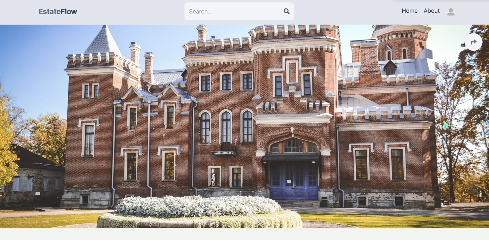
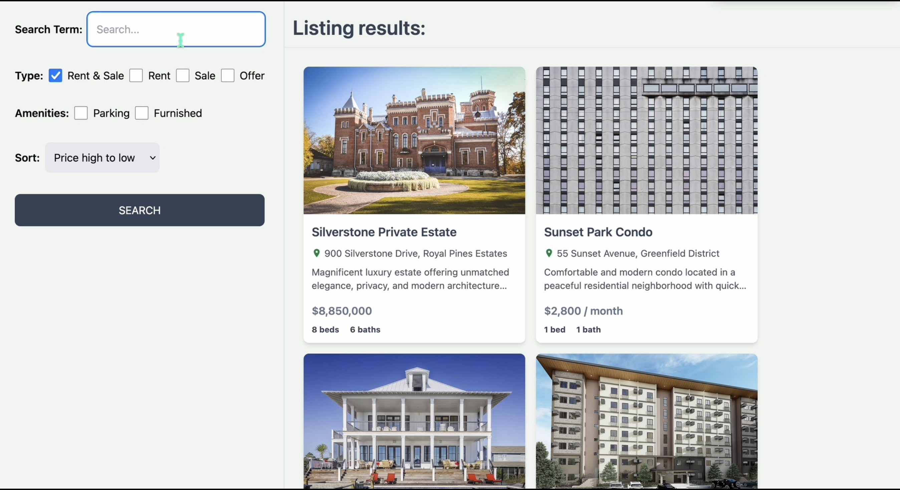
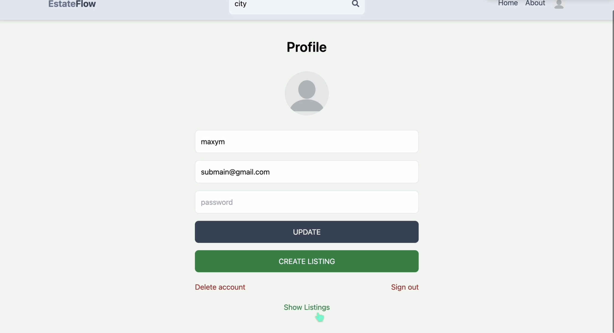
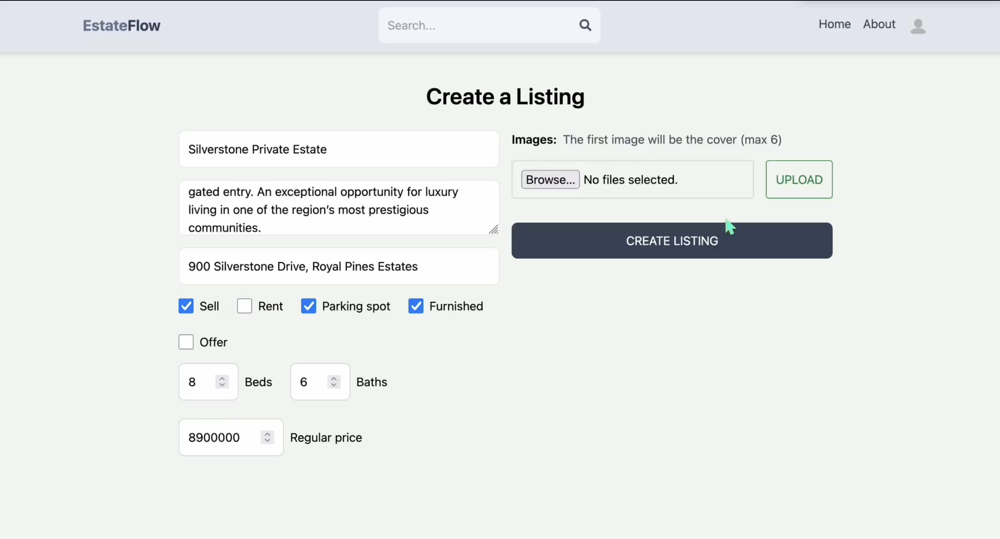
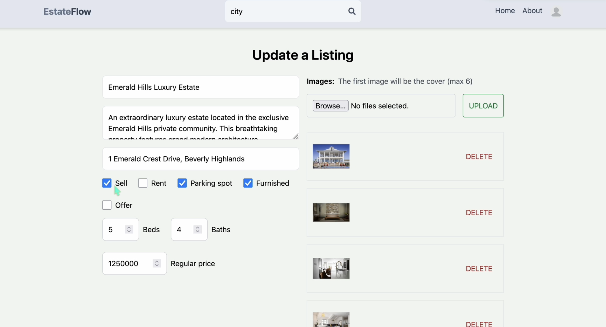
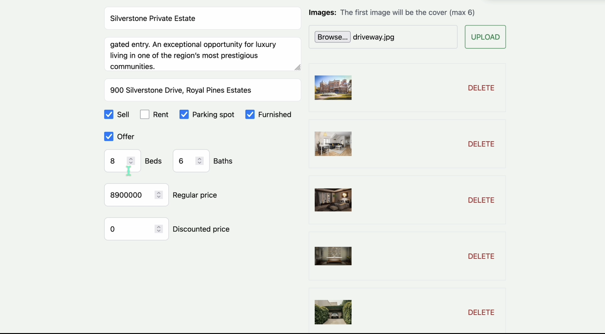

<h1 align="center">
  EstateFlow — Real Estate Marketplace
</h1>

<p align="center">
  
  
  
  
  
  
  
  
</p>

<p align="center">
  Full-stack MERN real estate marketplace for browsing, listing, and managing properties.
</p>

---

## Overview

**EstateFlow** is a modern full-stack real estate web application built on the MERN stack. It allows users to browse, search, and filter property listings across sale and rental categories, manage their own listings end-to-end, and contact landlords directly through the platform.

The platform supports:

- Browsing featured offers, rentals, and sales on the home page
- Advanced property search with type, amenity, and sort filters
- Full listing management — create, update, and delete listings with image uploads
- User authentication via email/password and Google OAuth (Firebase)
- Persistent user sessions with Redux Persist
- Secure JWT-based API with HTTP-only cookie sessions
- Profile management including avatar upload to Firebase Storage
- Docker-ready deployment with a single Express server serving both API and React build

Built with a clean separation between the `api/` backend (Express + Mongoose) and the `client/` frontend (React + Vite + Tailwind CSS).

---

## Preview

<p align="center">
  
</p>
<p align="center">
  Full application walkthrough — browsing listings, searching with filters, creating and editing a listing, and managing a user profile.
</p>
<p align="center">
  <a href=".github/assets/preview.gif">▶ Watch Full HD Preview</a>
</p>


---

### 🏠 Listing Detail

<p align="center">
  
</p>
<p align="center">
  Full-screen image carousel powered by Swiper, with property details, pricing, amenity icons, and a one-click landlord contact form via mailto.
</p>

---

### 🔍 Search & Filter

<p align="center">
  
</p>
<p align="center">
  Sidebar-driven search with filters for listing type (Rent / Sale / Both), amenities (Parking, Furnished), special offers, and sort order. Results paginate with a "Show more" loader.
</p>

---

### 👤 Profile

<p align="center">
  
</p>
<p align="center">
  User profile with avatar upload to Firebase Storage, inline account editing, and a full listing manager with delete and edit shortcuts.
</p>

---

### ➕ Create Listing

<p align="center">
  
</p>
<p align="center">
  Listing creation form with name, description, address, property type, amenities, bedroom/bathroom count, pricing, and multi-image upload (up to 6 images via Firebase Storage).
</p>

---

### ✏️ Update Listing

<p align="center">
  
</p>
<p align="center">
  Pre-populated listing editor that fetches existing data on mount. Supports full field editing with image management alongside the form.
</p>

---

### 🖼️ Listing Image Management

<p align="center">
  
</p>
<p align="center">
  Inline image preview panel with per-image delete buttons. New uploads are merged into the existing image set, with validation capping at 6 images per listing.
</p>

---

## Tech Stack

| Layer | Technology |
|---|---|
| Frontend | React 18, Vite, Tailwind CSS, Redux Toolkit, Redux Persist |
| Routing | React Router DOM v6 |
| UI Components | Swiper (carousel), React Icons |
| Backend | Node.js 20, Express 4 |
| Database | MongoDB 7 via Mongoose |
| Auth | JWT (HTTP-only cookie), bcryptjs, Firebase Google OAuth |
| File Storage | Firebase Storage |
| Containerization | Docker (separate Dockerfiles for API and client) |

---

## Project Structure

```
15-real-estate-moderate/
├── api/
│   ├── controllers/
│   │   ├── auth.controller.js       # Signup, signin, Google OAuth, signout
│   │   ├── user.controller.js       # User CRUD, listing retrieval by user
│   │   └── listing.controller.js    # Listing CRUD + advanced search/filter
│   ├── models/
│   │   ├── user.model.js            # User schema (username, email, password, avatar)
│   │   └── listing.model.js         # Listing schema (all property fields)
│   ├── routes/
│   │   ├── auth.route.js
│   │   ├── user.route.js
│   │   └── listing.route.js
│   ├── utils/
│   │   ├── error.js                 # Custom error handler
│   │   └── verifyUser.js            # JWT middleware
│   └── index.js                     # Express app entry point
├── client/
│   ├── src/
│   │   ├── components/
│   │   │   ├── Header.jsx
│   │   │   ├── ListingItem.jsx
│   │   │   ├── Contact.jsx
│   │   │   ├── OAuth.jsx
│   │   │   └── PrivateRoute.jsx
│   │   ├── pages/
│   │   │   ├── Home.jsx
│   │   │   ├── Search.jsx
│   │   │   ├── Listing.jsx
│   │   │   ├── Profile.jsx
│   │   │   ├── CreateListing.jsx
│   │   │   ├── UpdateListing.jsx
│   │   │   ├── SignIn.jsx
│   │   │   ├── SignUp.jsx
│   │   │   └── About.jsx
│   │   └── redux/
│   │       ├── store.js
│   │       └── user/userSlice.js
│   └── firebase.js
├── Dockerfile
└── package.json
```

---

## Getting Started

### Prerequisites

- Node.js 20+
- MongoDB instance (local or Atlas)
- Firebase project (for Google Auth and Storage)

### Environment Variables

Create a `.env` file in the project root:

```env
MONGO=mongodb+srv://<user>:<password>@cluster.mongodb.net/estateflow
JWT_SECRET=your_jwt_secret_here
VITE_FIREBASE_API_KEY=your_api_key
```

Configure Firebase credentials in `client/src/firebase.js`.

### Installation & Development

```bash
# Install backend dependencies
npm install

# Install frontend dependencies and start dev server
npm run dev                        # starts Express on :3000
cd client && npm install && npm run dev   # starts Vite on :5173
```

### Production Build

```bash
npm run build    # installs deps + builds the React client into client/dist
npm start        # serves everything from Express on :3000
```

### Docker

```bash
docker build -t estateflow .
docker run -p 3000:3000 --env-file .env estateflow
```

---

## API Endpoints

### Auth — `/api/auth`

| Method | Route | Description |
|---|---|---|
| POST | `/signup` | Register a new user |
| POST | `/signin` | Sign in with email/password |
| POST | `/google` | Sign in or register via Google OAuth |
| GET | `/signout` | Clear session cookie |

### User — `/api/user` *(protected)*

| Method | Route | Description |
|---|---|---|
| POST | `/update/:id` | Update username, email, password, avatar |
| DELETE | `/delete/:id` | Delete account and clear cookie |
| GET | `/listings/:id` | Get all listings owned by user |
| GET | `/:id` | Get public user profile |

### Listings — `/api/listing`

| Method | Route | Auth Required | Description |
|---|---|---|---|
| POST | `/create` | ✅ | Create a new listing |
| POST | `/update/:id` | ✅ | Update an existing listing |
| DELETE | `/delete/:id` | ✅ | Delete a listing |
| GET | `/get/:id` | ❌ | Get a single listing |
| GET | `/get` | ❌ | Search/filter listings with query params |

#### Search Query Parameters (`GET /api/listing/get`)

| Param | Type | Default | Description |
|---|---|---|---|
| `searchTerm` | string | `''` | Name search (case-insensitive regex) |
| `type` | `sale` \| `rent` \| `all` | `all` | Listing type |
| `offer` | boolean | any | Filter by special offer |
| `parking` | boolean | any | Filter by parking availability |
| `furnished` | boolean | any | Filter by furnished status |
| `sort` | string | `createdAt` | Sort field |
| `order` | `asc` \| `desc` | `desc` | Sort direction |
| `limit` | number | `9` | Results per page |
| `startIndex` | number | `0` | Pagination offset |

---

## Known Issues

- `Search.jsx` initialises `sort` as `'created_at'` but the backend field is `'createdAt'` — sort may not apply correctly on initial load.
- `Home.jsx` has a `log(error)` typo (missing `console.`) in `fetchSaleListings`, which will throw a ReferenceError on fetch failure.
- JWT tokens have no `expiresIn` set — sessions never expire server-side.
- Firebase API key is hardcoded in `client/src/firebase.js` — should be moved to environment variables for production.
- `client/Dockerfile` is empty.
